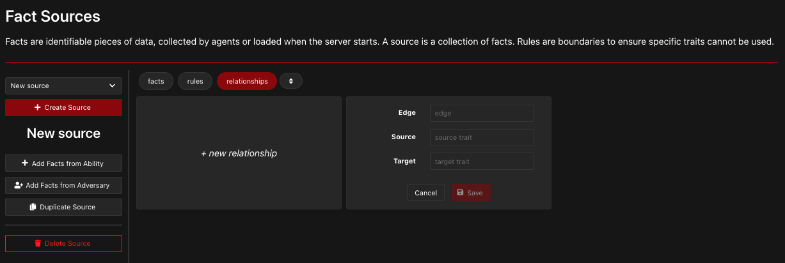

# Relationships

Many CALDERA abilities require input variables called "facts" to be provided before the ability can be run. These facts can be provided through fact sources, or they can be discovered by a previous ability.

## Creating Relationships using Abilities

### Example

As an example, the following printer discovery ability will create two facts called `host.print.file` and `host.print.size`:

```yaml
- id: 6c91884e-11ec-422f-a6ed-e76774b0daac
  name: View printer queue
  description: View details of queued documents in printer queue
  tactic: discovery
  technique:
    attack_id: T1120
    name: Peripheral Device Discovery
  platforms:
    darwin:
      sh:
        command: lpq -a
        parsers:
          plugins.stockpile.app.parsers.printer_queue:
          - source: host.print.file
            edge: has_size
            target: host.print.size
```

This ability will view the printer queue using the command `lpq -a`. The result of `lpq -a` will be parsed into two facts: `host.print.file` (the `source`) and `host.print.size` (the `target`). These two facts are dependent on each other, and it will be helpful to understand their connection in order to use them. Therefore, we use the `edge` variable to explain the relationship between the `source` and the `target`. In this case, the `edge` is `has_size`, because `host.print.size` is the file size of `host.print.file`. All together, the `source`, `edge`, and `target` comprise a "relationship". To learn more about how the parser file creates a relationship, refer to [Parsers](Parsers.md).

### Multiple Instances of a Fact
Storing the relationship between the `source` and the `target` in the `edge` allows CALDERA to save several instances of each fact while maintaining the connection between facts. For example, if the printer discovery ability (shown above) is run, and several files are discovered in the printer queue, the following facts may be created. 

| host.print.file | host.print.size (bytes) |
| --------------- | ----------------------- |
| essay.docx      | 12288                   |
| image-1.png     | 635000                  |
| Flier.pdf       | 85300                   |

The table above shows how each `host.print.file` value is associated with exactly one `host.print.size` value. This demonstrates the importance of the `edge`; it maintains the association between each pair of `source` and `target` values. Without the `edge`, we would just have a list of values but no information about their relationships, similar to the following:

- `host.print.file`: `essay.docx`, `image-1.png`, `Flier.pdf`
- `host.print.size`: `12288`, `635000`, `85300`


### Optional Components

Note that the `edge` and the `target` are optional. You can create a `source` as an independent fact without needing to connect it to a `target`. 


## Creating Relationships using CALDERA Server
Relationships can also be created in the CALDERA Server GUI. Use the left sidebar to navigate to "fact sources." Then, click "relationships" followed by "new relationship." You can fill in  values for the `edge`, `source`, and `target` to be used in future operations. Then click "Save" to finish!


